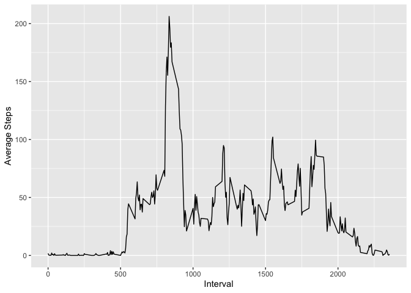
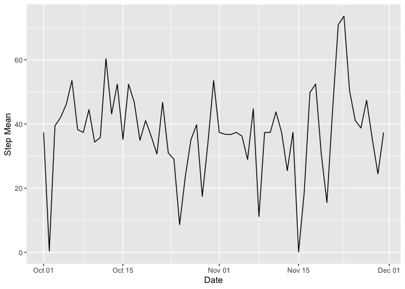
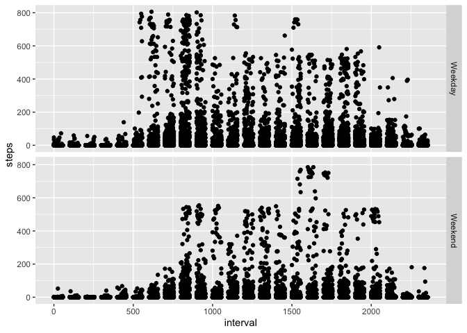
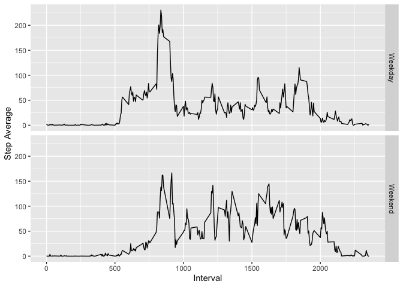

## R Markdown

Read in and prepare the data. We want to change the class of the date from a character string to a Date class.

```r
library(ggplot2)
library(dplyr)
```

```
## 
## Attaching package: 'dplyr'
```

```
## The following objects are masked from 'package:stats':
## 
##     filter, lag
```

```
## The following objects are masked from 'package:base':
## 
##     intersect, setdiff, setequal, union
```

```r
work<-read.csv("~/Downloads/activity.csv")
head(work)
```

```
##   steps       date interval
## 1    NA 2012-10-01        0
## 2    NA 2012-10-01        5
## 3    NA 2012-10-01       10
## 4    NA 2012-10-01       15
## 5    NA 2012-10-01       20
## 6    NA 2012-10-01       25
```

```r
work$date<-as.Date(work$date)
class(work$date)
```

```
## [1] "Date"
```

To find the total number of steps per day, we want to see the total number of steps for each Date.

```r
dailysteps<-work %>% group_by(date) %>% summarize(total_steps=sum(steps, na.rm=TRUE))
```

```
## `summarise()` ungrouping output (override with `.groups` argument)
```

```r
dailysteps
```

```
## # A tibble: 61 x 2
##    date       total_steps
##    <date>           <int>
##  1 2012-10-01           0
##  2 2012-10-02         126
##  3 2012-10-03       11352
##  4 2012-10-04       12116
##  5 2012-10-05       13294
##  6 2012-10-06       15420
##  7 2012-10-07       11015
##  8 2012-10-08           0
##  9 2012-10-09       12811
## 10 2012-10-10        9900
## # … with 51 more rows
```

```r
hist(dailysteps$total_steps, xlab="Total Number of Steps", main="Histogram of the Total Number of Steps per Day")
```

-1.png)<!-- -->


The above code and graph shows how many steps are taking per day. Now we want to see the mean and median for each day.

```r
dailysmm<- work %>% group_by(date) %>% summarize(stepmean= mean(steps, na.rm=TRUE), stepmedian=median(steps, ma.rm=TRUE), dailysteps=sum(steps, na.rm=TRUE))
```

```
## `summarise()` ungrouping output (override with `.groups` argument)
```

```r
dailysmm
```

```
## # A tibble: 61 x 4
##    date       stepmean stepmedian dailysteps
##    <date>        <dbl>      <dbl>      <int>
##  1 2012-10-01  NaN             NA          0
##  2 2012-10-02    0.438          0        126
##  3 2012-10-03   39.4            0      11352
##  4 2012-10-04   42.1            0      12116
##  5 2012-10-05   46.2            0      13294
##  6 2012-10-06   53.5            0      15420
##  7 2012-10-07   38.2            0      11015
##  8 2012-10-08  NaN             NA          0
##  9 2012-10-09   44.5            0      12811
## 10 2012-10-10   34.4            0       9900
## # … with 51 more rows
```
So now we have calculated the mean, median, and total number of steps taken each day. The columns that say NA or NAN are columns where there is missing data because there are no records for that day.
Now let's see what the average daily activity pattern looks like. We will create a time series plot of the 5 minute intervals and  take the average steps taken.


```r
daily_active<- work %>% group_by(interval) %>% summarize(Average_Steps=mean(steps, na.rm=TRUE))
```

```
## `summarise()` ungrouping output (override with `.groups` argument)
```

```r
daily_active
```

```
## # A tibble: 288 x 2
##    interval Average_Steps
##       <int>         <dbl>
##  1        0        1.72  
##  2        5        0.340 
##  3       10        0.132 
##  4       15        0.151 
##  5       20        0.0755
##  6       25        2.09  
##  7       30        0.528 
##  8       35        0.868 
##  9       40        0     
## 10       45        1.47  
## # … with 278 more rows
```

```r
time<- ggplot(daily_active, aes(interval, Average_Steps)) + geom_line()+
  xlab("Interval") + ylab("Average Steps")
time
```

<!-- -->


We have the table and the graph, now we want to see which interval has the maximum number of steps


```r
maxnum<-daily_active %>% filter(Average_Steps==max(Average_Steps)) %>% select(interval)
maxnum$interval[1]
```

```
## [1] 835
```
This means that the maximum number of steps occurred during a 835 minute interval.

We've seen a lot in our code that we have missing values. Let's try to get rid of those so our graphs can be a little more helpful. We will fill in the missing data with the average number for that specific 5 minute interval.
We will also make a new dataset with the filled in data so we can keep our datasets organized.

```r
sum(is.na(work))
```

```
## [1] 2304
```

```r
fulldata<- work
head(fulldata)
```

```
##   steps       date interval
## 1    NA 2012-10-01        0
## 2    NA 2012-10-01        5
## 3    NA 2012-10-01       10
## 4    NA 2012-10-01       15
## 5    NA 2012-10-01       20
## 6    NA 2012-10-01       25
```

```r
fulldata$date<- as.Date(fulldata$date)


for (ind in 1:nrow(fulldata)) {
  if (is.na(fulldata$steps[ind])){
      x=fulldata$interval[ind]
      y=which(daily_active$interval==x)
      fulldata$steps[ind]<-daily_active$Average_Steps[y]
  }
}

sum(is.na(fulldata))
```

```
## [1] 0
```

```r
head(fulldata)
```

```
##       steps       date interval
## 1 1.7169811 2012-10-01        0
## 2 0.3396226 2012-10-01        5
## 3 0.1320755 2012-10-01       10
## 4 0.1509434 2012-10-01       15
## 5 0.0754717 2012-10-01       20
## 6 2.0943396 2012-10-01       25
```
We calculated the sum of missing values in the data to double check that we don't hvae any more missing values in our data. If the number is 0, that means our code has succesfully filled all missing values. We also called the head function to compare the datasets. We can see that before we ran our for loop, the had 2304 rows with missing values, and after the for loop, there are numbers to fill in the missing values

Now let's try making our graphs again. We will try the histogram to show the total number of steps taken each day, and a line graph to show the average number of steps taken over time

```r
new_dailysteps<-fulldata %>% group_by(date) %>% summarize(total_steps=sum(steps, na.rm=TRUE))
```

```
## `summarise()` ungrouping output (override with `.groups` argument)
```

```r
hist(new_dailysteps$total_steps, xlab="Total number of steps", main="Histogram of the Total Number of Steps per Day")
```

-1.png)<!-- -->

```r
sum(is.na(fulldata))
```

```
## [1] 0
```


```r
new_dailysmm<- fulldata %>% group_by(date) %>% summarize(stepmean= mean(steps, na.rm=TRUE), stepmedian=median(steps, ma.rm=TRUE), dailysteps=sum(steps, na.rm=TRUE))
```

```
## `summarise()` ungrouping output (override with `.groups` argument)
```

```r
new_time<- ggplot(new_dailysmm, aes(date, stepmean, group=1)) + geom_line()+
  xlab("Date") +ylab("Step Mean")
new_time
```

<!-- -->

Note that all these codes are the same ones as before, the only difference is the original dataset we used to store the values of the average, median, and total number of steps.
In our line graph, we can see that all the lines are connected and there are no gaps.


Let's also see a table with the mean and median of number of steps taken, using the full dataset. 

```r
full_mean_median<- fulldata %>% group_by(date) %>% summarize( Mean= mean(steps), Median=median(steps), Total=sum(steps))
```

```
## `summarise()` ungrouping output (override with `.groups` argument)
```

```r
full_mean_median
```

```
## # A tibble: 61 x 4
##    date         Mean Median  Total
##    <date>      <dbl>  <dbl>  <dbl>
##  1 2012-10-01 37.4     34.1 10766.
##  2 2012-10-02  0.438    0     126 
##  3 2012-10-03 39.4      0   11352 
##  4 2012-10-04 42.1      0   12116 
##  5 2012-10-05 46.2      0   13294 
##  6 2012-10-06 53.5      0   15420 
##  7 2012-10-07 38.2      0   11015 
##  8 2012-10-08 37.4     34.1 10766.
##  9 2012-10-09 44.5      0   12811 
## 10 2012-10-10 34.4      0    9900 
## # … with 51 more rows
```
These are the calculated means and medians of the steps taken per day with our full dataset. Let's see how this differs from our data set with missing values


```r
dailysmm
```

```
## # A tibble: 61 x 4
##    date       stepmean stepmedian dailysteps
##    <date>        <dbl>      <dbl>      <int>
##  1 2012-10-01  NaN             NA          0
##  2 2012-10-02    0.438          0        126
##  3 2012-10-03   39.4            0      11352
##  4 2012-10-04   42.1            0      12116
##  5 2012-10-05   46.2            0      13294
##  6 2012-10-06   53.5            0      15420
##  7 2012-10-07   38.2            0      11015
##  8 2012-10-08  NaN             NA          0
##  9 2012-10-09   44.5            0      12811
## 10 2012-10-10   34.4            0       9900
## # … with 51 more rows
```

```r
full_mean_median
```

```
## # A tibble: 61 x 4
##    date         Mean Median  Total
##    <date>      <dbl>  <dbl>  <dbl>
##  1 2012-10-01 37.4     34.1 10766.
##  2 2012-10-02  0.438    0     126 
##  3 2012-10-03 39.4      0   11352 
##  4 2012-10-04 42.1      0   12116 
##  5 2012-10-05 46.2      0   13294 
##  6 2012-10-06 53.5      0   15420 
##  7 2012-10-07 38.2      0   11015 
##  8 2012-10-08 37.4     34.1 10766.
##  9 2012-10-09 44.5      0   12811 
## 10 2012-10-10 34.4      0    9900 
## # … with 51 more rows
```

```r
total_steps_na<- sum(work$steps, na.rm=TRUE)
total_steps_full<- sum(fulldata$steps)
total_steps_na
```

```
## [1] 570608
```

```r
total_steps_full
```

```
## [1] 656737.5
```
We can see the difference now. Every row is filled in and the data seems informative. When we compare the sum of steps taken we can see a large difference as well.


In the next graph, we want to compare the activity or number of steps from the weekend and the weekday.First we want to categorize the days of the week by the date, and then assign them as as a week day or a weekend.

```r
fulldata$day<-weekdays(fulldata$date)
head(fulldata)
```

```
##       steps       date interval    day
## 1 1.7169811 2012-10-01        0 Monday
## 2 0.3396226 2012-10-01        5 Monday
## 3 0.1320755 2012-10-01       10 Monday
## 4 0.1509434 2012-10-01       15 Monday
## 5 0.0754717 2012-10-01       20 Monday
## 6 2.0943396 2012-10-01       25 Monday
```

```r
fulldata<- fulldata %>% mutate(day_week= ifelse(day=="Saturday"|day=="Sunday", "Weekend", "Weekday"))
head(fulldata)
```

```
##       steps       date interval    day day_week
## 1 1.7169811 2012-10-01        0 Monday  Weekday
## 2 0.3396226 2012-10-01        5 Monday  Weekday
## 3 0.1320755 2012-10-01       10 Monday  Weekday
## 4 0.1509434 2012-10-01       15 Monday  Weekday
## 5 0.0754717 2012-10-01       20 Monday  Weekday
## 6 2.0943396 2012-10-01       25 Monday  Weekday
```

And now, for the graph.

```r
fulldata$day_week<- as.factor(fulldata$day_week)
class(fulldata$day_week)
```

```
## [1] "factor"
```

```r
ggplot(fulldata, aes(interval, steps, group=day_week)) + geom_point()+
  facet_grid(day_week~.)
```

<!-- -->
This graph just takes a look at each individual point. But the next graph will take the average from each interval point and see how those averages differ on weekends and weekdays.

First we create a chart to summarize the information we want, and then we graph that chart

```r
ww<- fulldata %>% group_by(day_week, interval) %>% summarize(Step_average=mean(steps))
```

```
## `summarise()` regrouping output by 'day_week' (override with `.groups` argument)
```

```r
ww
```

```
## # A tibble: 576 x 3
## # Groups:   day_week [2]
##    day_week interval Step_average
##    <fct>       <int>        <dbl>
##  1 Weekday         0       2.25  
##  2 Weekday         5       0.445 
##  3 Weekday        10       0.173 
##  4 Weekday        15       0.198 
##  5 Weekday        20       0.0990
##  6 Weekday        25       1.59  
##  7 Weekday        30       0.693 
##  8 Weekday        35       1.14  
##  9 Weekday        40       0     
## 10 Weekday        45       1.80  
## # … with 566 more rows
```

```r
ggplot(ww, aes(interval, Step_average, group=day_week))+
  geom_line()+
  facet_grid(day_week~.)+
  xlab("Interval")+
  ylab("Step Average")
```

<!-- -->


